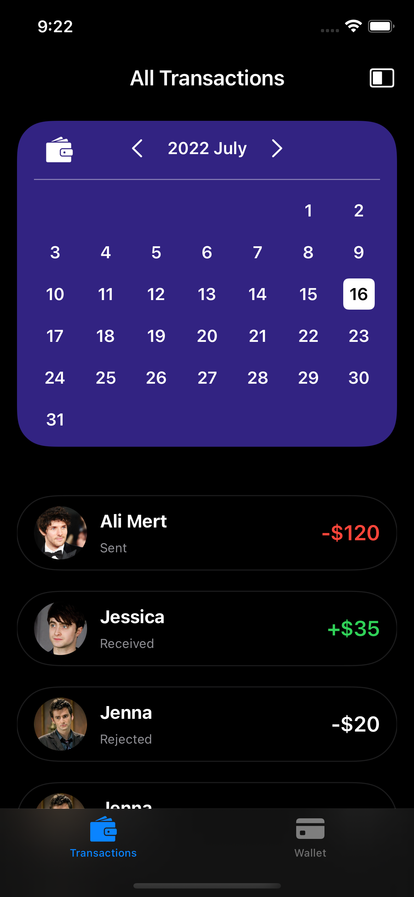
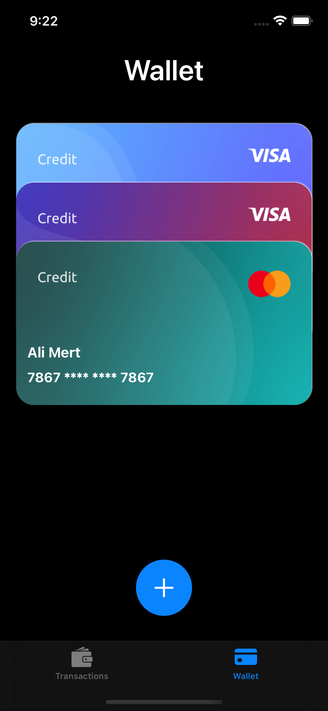
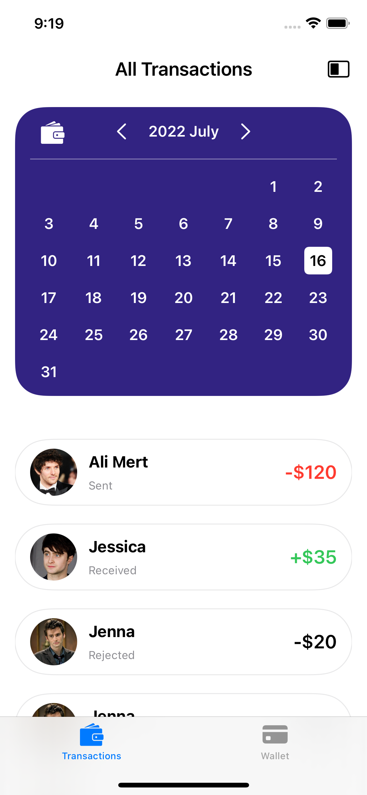

# Bank App

A SwiftUI demo project.

'<t>HidableTabView</t>' package is used for hiding and showing TabView wwith animation.  
'<t>HideableTabView</t>' framework can be added to your project as a package thorught SPM.  

To get more info about the package:
<ul>
    <li> https://gitlab.com/AliMertOzhayta/hidabletabview-swiftui/ </li>
</ul>

 

<table>
<thead>
   <tr>
        <th colspan="5">
Screenshots
</th>
  </tr>
</thead>
<tbody>
   <tr>
        <td>
          
        </td>
        <td>
          
        </td>
        <td>
         
       </td>
       <td>
         
     </td>
      <td>
         
     </td>
  </tr>
  <tr>
        <td>
          
        </td>
        <td>
          
        </td>
        <td>
         
     </td>
      <td>
         
     </td>
      <td>
         
     </td>
  </tr>
  <tr> 
     <th colspan="5">
     

        <b>Demo</b>

</th>
  </tr>
  <tr>
     <td colspan="5">  </td>
  </tr>
</tbody>
</table>
